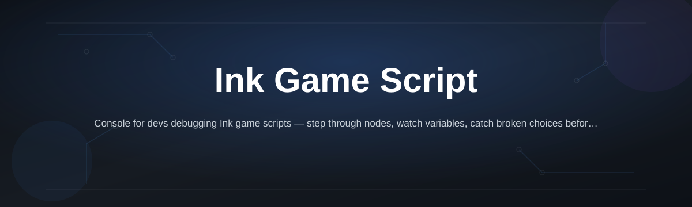
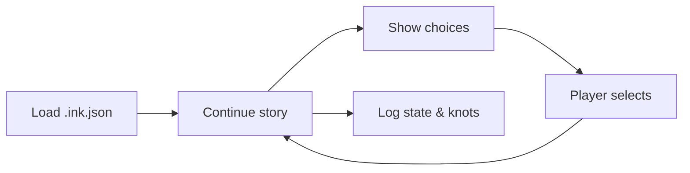

# ink-game-script-console

*A console for writers who'd rather test their Ink narrative than fight a build pipeline.*

## What this is

**ink-game-script-console** is a standalone runner for Ink game scripts — the branching-dialogue format that powers narrative games built with Inkle's Ink language. Instead of wiring your `.ink` file into a full game engine just to see if a choice knot fires correctly, you drop the script into this console and play through it like a player would, right in a terminal-style window.

It's not an editor and it's not a compiler replacement. It sits *after* you've written your Ink script and *before* you've committed to a game engine integration. Writers use it to proof dialogue trees. Developers use it to sanity-check variables, tags, and diverts before wiring the story into Unity, Godot, or a custom engine. If you've ever compiled a story into Ink's JSON runtime format and just wanted to *read it back*, that's this tool's whole job.

  

The button above opens the project's landing page, where you download the current build.

## Who it is for

- **Narrative writers** who want to playtest branching dialogue without opening a game engine
- **Solo devs** integrating Ink into Unity/Godot who need a fast way to check compiled `.ink.json` output
- **Game jam teams** where the writer isn't the programmer and needs an independent way to verify story logic
- **Ink learners** working through knots, stitches, and weave syntax for the first time
- **QA/narrative testers** tracing variable state across long branching paths

## What you can do

| Capability | Detail |
|---|---|
| **Run compiled Ink JSON directly** | Load the output from Inky or `inklecate` and play it immediately |
| **Step through choices like a real player** | Numbered choice prompts, no manual state tracking |
| **Inspect live variables** | Watch Ink globals and temps change as you make choices |
| **Trace visited knots and stitches** | See exactly which nodes fired, in order, for debugging dead ends |
| **Jump to any knot on demand** | Skip to a specific scene without replaying the whole tree from the top |
| **Log full playthrough sessions** | Export a session transcript to check pacing or share with a writer |
| **Handle tags and external functions gracefully** | Unrecognized tags don't crash the run — they print and continue |
| **Run offline, no dependencies** | Single executable, no runtime install required |

## Getting started

1. Open the [landing page](https://guardwarrioratrium.github.io/ink-game-script-console/) and download the current build.
2. Extract the archive to any folder — no installer, no setup wizard.
3. Compile your Ink script to JSON using Inky or `inklecate` (the console reads compiled output, not raw `.ink` source).
4. Launch `ink-game-script-console.exe` and point it at your JSON file.
5. Play through your story, watching variables and knot traces in the side panel.

## Requirements

- Windows 10 or 11 (64-bit)
- No .NET SDK, no Node, no build toolchain — it's a standalone executable
- A compiled Ink JSON file (from Inky, `inklecate`, or your build pipeline)
- Roughly 40MB of disk space

## How it works

The console loads a compiled Ink runtime file and drives it the same way a game engine's Ink plugin would — calling `Continue()`, reading choices, and feeding selections back in. It exposes what's normally hidden inside your game: variable state, visit counts, and the exact sequence of knots the story walks through.

No Ink runtime source code ships inside the tool — it links against the standard Ink runtime, so behavior matches what your actual game would produce.

## FAQ

**Does this compile `.ink` files, or only run compiled JSON?**
Only compiled JSON. Use Inky (Inkle's editor) or the `inklecate` command-line compiler to produce the `.json` runtime file first.

**Can I use this instead of integrating Ink into my game engine?**
No — it's a testing and proofing step. You still need the Ink runtime plugin (Unity, Godot, etc.) for the actual shipped game.

**Does it support Ink's external functions and tags?**
Tags are logged and displayed. External functions that aren't bound will print a placeholder instead of crashing the session.

**Will it run my old Ink scripts from a previous engine version?**
Generally yes, as long as they were compiled with a runtime-compatible version of `inklecate`. Very old JSON schemas may need recompiling.

**Is there a Mac or Linux build?**
Not currently. The console targets Windows 10/11 only — check the landing page for future platform updates.

## Troubleshooting

**"Failed to parse story JSON"** — Your file was likely compiled with an incompatible `inklecate` version. Recompile with a recent version of Inky.

**Choices don't appear, story just ends** — Check for a missing `-> END` or `-> DONE` in your knot; the runtime may be reporting a clean stop, not an error.

**Variables show as `null` or undefined** — Confirm the variable is declared with `VAR` at the top level of your Ink script before it's referenced in a knot.

**Console window closes immediately on launch** — Run it from a terminal instead of double-clicking, so you can read the startup error before the window exits.

## License

Released under the [MIT License](LICENSE). Use it, modify it, ship it in your own tools — no warranty, no liability, standard MIT terms apply.

  

